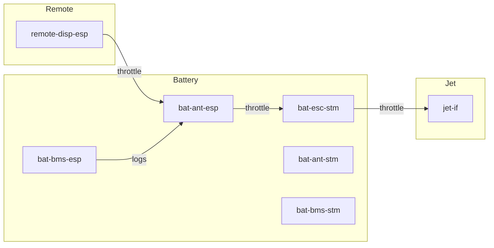
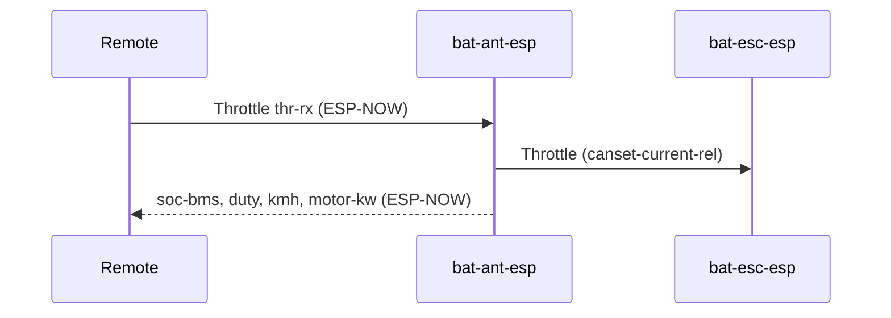
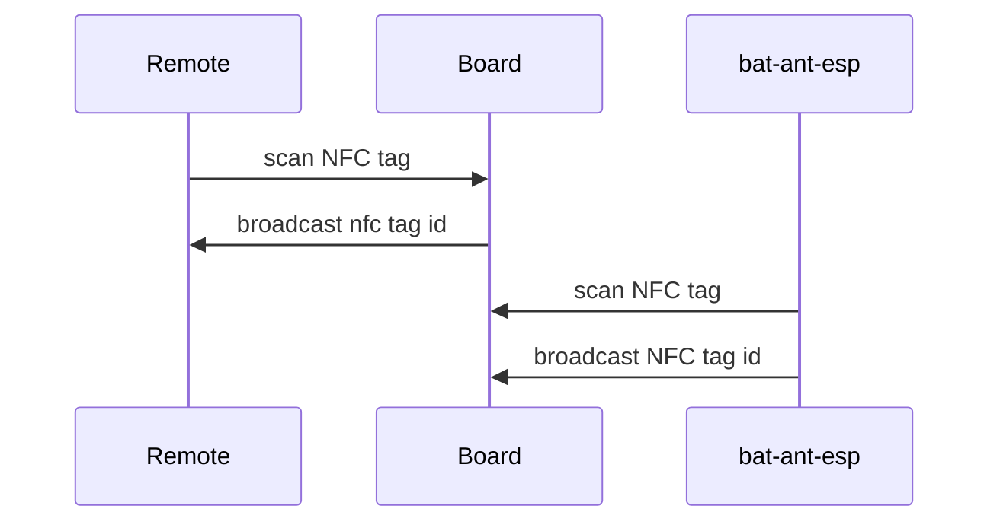

# Lindboard Firmware

## Overview

| Part    | PCB  | MCU        | ID                                  | CAN NAME    | CAN ID | Firmware     |
| :------ | ---- | :--------- | ----------------------------------- | ----------- | :----- | :----------- |
| Battery | ESC  | STM32-F4   | [bat-esc-stm](#bat-esc-stm)         | LB          | 10, 11 | bldc         |
| Battery | BMS  | STM32-L4   | [bat-bms-stm](#bat-bms-stm)         | BMS(lb)     | 20     | vesc_bms_fw  |
| Battery | BMS  | ESP32-C3   | [bat-bms-esp](#bat-bms-esp)         | LB BMS Wifi | 21     | vesc_express |
| Battery | ANT  | STM32-G431 | [bat-ant-stm](#bat-ant-stm)         | LB-ANT-STM  | 30     | vesc_gpstm   |
| Battery | ANT  | ESP32-C3   | [bat-ant-esp](#bat-ant-esp)         | LB_ANT      | 31     | vesc_express |
| Jet     | IF   | ESP32-C3   | [jet-if-esp](#jet-if-esp)           |             | 40     | vesc_express |
| Remote  | DISP | ESP32-C3   | [remote-disp-esp](#remote-disp-esp) |             | 50     | vesc_express |



## How to Build and Flash

```shell
nix develop
make
```


## Battery

### bat-esc-stm

* Handles engine control
* Runs LispBM code-server
* Receives throttle RPC calls over CAN/code-server

### bat-bms-stm

* Battery management system
* Measures battery level

### bat-ant-esp

* Handle connection to 4G
* Handle connection to Remote via esp-now
* Writes logs to SD card
* Handle NFC

### bat-ant-stm


### bat-bms-esp

* WiFi connectivity

## Jet

### jet-if-esp

* Receive throttle from battery

## Remote

### remote-disp-esp

* Send throttle via espnow

## Flows

## Throttle flow



## Pairing flow



## Logging low


## VESC Express

```sh
git clone git@github.com/vedderb/vesc_express

# Install Espressif SDK
./install.sh esp32c3

source export.sh
# or source export.fish if you are runnish fish shell

cd ..
cd vesc_express
# Edit main/conf_general.h to include correct file
idf.py build

# Flash build/vesc_express.bin using VESC Tool
```

### Battery/ESC - STM32F4

```sh
# Arm tooling can be installed with 
make arm_sdk_install`
# when done, add to path
set -x PATH $PATH:$HOME/bldc/tools/gcc-arm-none-eabi-7-2018-q2-update/bin/

# copy HW files
cp ../FirmwareGuide/conf_bldc/lb/* ./hwconf/lb/

#Build
make lb
```
Files are in build/lb/lb.bin

### Battery/BMS - STM32L4

```sh
git clone git@github.com:vedderb/vesc_bms_fw
cd vesc_bms_fw
cp ../FirmwareGuide/conf_bms/* hwconf/

# Edit conf_general.h to point to hw_lb.h/c
make
```

### Battery/BMS - ESP32-C3

See vesc_express instructions

edit main/conf_general.h to include right hw file

### Battery/Antenna - STM32G431

See vesc_express instructions

edit main/conf_general.h to include right hw file

### Battery/Antenna - ESP32-C3

See vesc_express instructions

edit main/conf_general.h to include right hw file

### Jet/Interface - ESP32-C3

See vesc_express instructions

edit main/conf_general.h to include right hw file

### Remote/Display - ESP32-C3

See vesc_express instructions

edit main/conf_general.h to include right hw file
