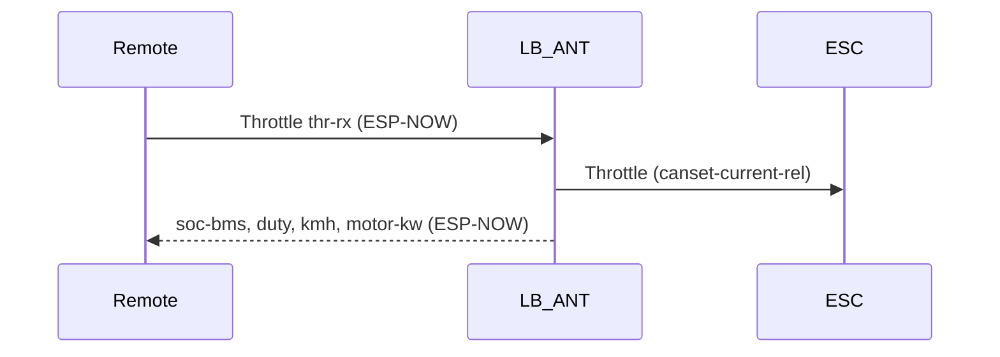
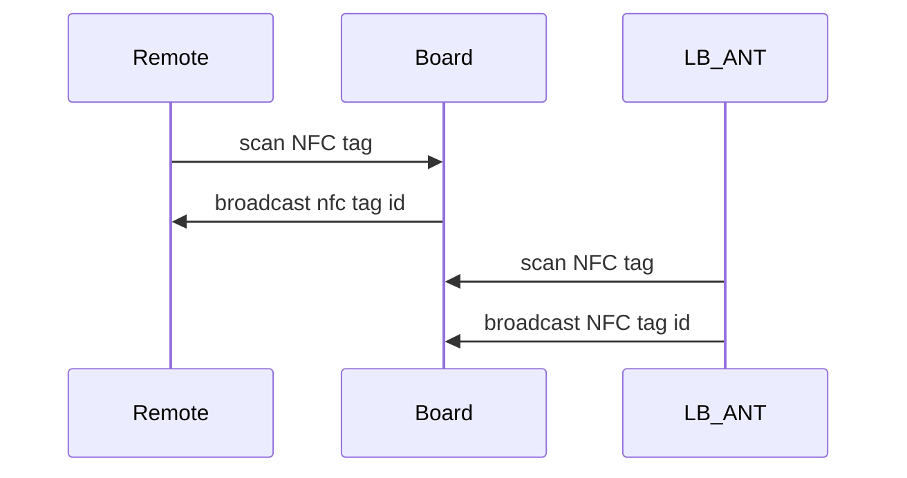

# Firmware Guide
Description of how to get and flash the firmwares for the different boards

## Overview

The following is a summary of all microcontrollers (MCUs) present on the lindboard parts (Battery, Jet and Remote). Note that the CAN IDs in this table are set by default in the hardware files.

| Part    | PCB       | MCU       | CAN NAME    | CAN ID | Firmware     | LispBM | HW-file                                                              |
|:--------|-----------|:----------|-------------|:-------|:-------------|--------|:---------------------------------------------------------------------|
| Battery | ESC       | STM32F4   | LB          | 10, 11 | bldc         |        | `./conf_bldc`                                                        |
| Battery | BMS       | STM32L4   | BMS(lb)     | 20     | vesc_bms_fw  |        | `./conf_bms/hw_lb.c`, `./conf_bms/hw_lb.h`                           |
| Battery | BMS       | ESP32-C3  | LB BMS Wifi | 21     | vesc_express |        | `./conf_express/hw_lb_bms_wifi.c`, `./conf_express/hw_lb_bms_wifi.h` |
| Battery | Antenna   | STM32G431 | LB-ANT-STM  | 30     | vesc_gpstm   |        | `./conf_gpstm/hw_lb_ant.c`, `./conf_gpstm/hw_lb_ant.h`               |
| Battery | Antenna   | ESP32-C3  | LB_ANT      | 31     | vesc_express |        | `./conf_express/hw_lb_ant.c`, `./conf_express/hw_lb_ant.h`           |
| Jet     | Interface | ESP32-C3  |             | 40     | vesc_express |        | `./conf_express/hw_lb_if.c`, `./conf_express/hw_lb_if.h`             |
| Remote  | Display   | ESP32-C3  |             | 50     | vesc_express |        | `./conf_express/hw_lb_hc.c`, `./conf_express/hw_lb_hc.c`             |

## LispBM source

Remote https://github.com/Lindboard/remote_software
Battery https://github.com/Lindboard/Lind_Battery_Software
LB Ant https://github.com/Lindboard/hwconf_vesc_express

## Architecture

### LB_ANT

* Handles connection to Remote, WiFi, 4G
* Handles NFC

### LB-ANT-STM

* ?

### LB / ESC

* Handles engine control
* Runs LispBM code-server
* Receives throttle RPC calls over CAN/code-server

### LB BMS

* Battery management system
* Measures battery level

## Throttle flow



## Pairing flow



## How to Build and Flash

## VESC Express

```sh
git clone git@github.com/vedderb/vesc_express

# Install Espressif SDK
./install.sh esp32c3

source export.sh
# or source export.fish if you are runnish fish shell

cd ..
cd vesc_express
# Edit main/conf_general.h to include correct file
idf.py build

# Flash build/vesc_express.bin using VESC Tool
```

### Battery/ESC - STM32F4

```sh
# Arm tooling can be installed with 
make arm_sdk_install`
# when done, add to path
set -x PATH $PATH:$HOME/bldc/tools/gcc-arm-none-eabi-7-2018-q2-update/bin/

# copy HW files
cp ../FirmwareGuide/conf_bldc/lb/* ./hwconf/lb/

#Build
make lb
```shell
Files are in build/lb/lb.bin

### Battery/BMS - STM32L4

```sh
git clone git@github.com:vedderb/vesc_bms_fw
cd vesc_bms_fw
cp ../FirmwareGuide/conf_bms/* hwconf/

# Edit conf_general.h to point to hw_lb.h/c
make
```

### Battery/BMS - ESP32-C3

See vesc_express instructions

edit main/conf_general.h to include right hw file

### Battery/Antenna - STM32G431

See vesc_express instructions

edit main/conf_general.h to include right hw file

### Battery/Antenna - ESP32-C3

See vesc_express instructions

edit main/conf_general.h to include right hw file

### Jet/Interface - ESP32-C3

See vesc_express instructions

edit main/conf_general.h to include right hw file

### Remote/Display - ESP32-C3

See vesc_express instructions

edit main/conf_general.h to include right hw file
